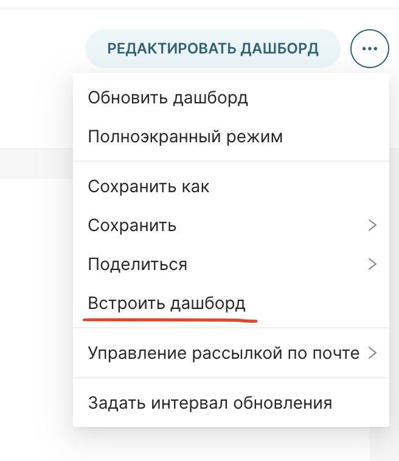
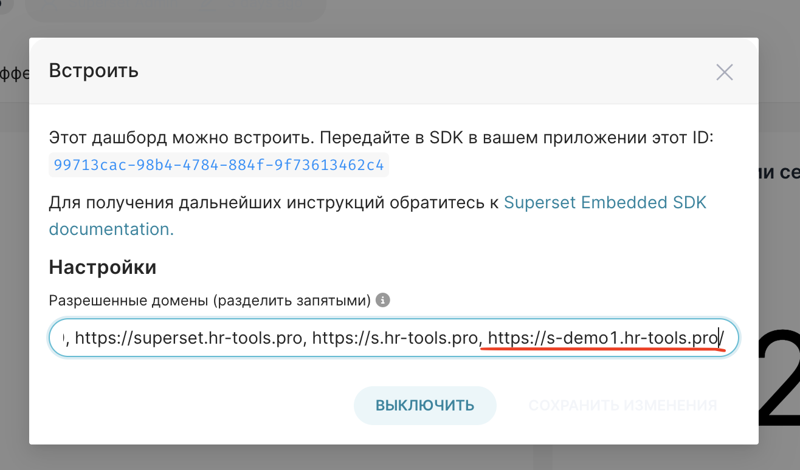

# hr-tools backend

## Swagger
http://localhost:8080/swagger#

### Создание организации, спейса и администратора спейса

```bash
curl --location --request POST 'http://localhost:8080/api/v1/organizations' \
--header 'accept: application/json' \
--header 'Content-Type: application/json' \
--data-raw '{
    "admin_data": {
        "email": "admin_demo@demo-org1.com",
        "first_name": "Иван",
        "last_name": "Смирнов",
        "password": "61bae227",
        "phone_number": "+7977744455522"
    },
    "director_name": "Иван Смирнов",
    "full_name": "Смирнов И.И.",
    "inn": "1234567890",
    "kpp": "123456",
    "ogrn": "123456",
    "organization_name": "ООО ДЕМО1"
}'
```

## Superset

### Настройка домена для дашборда superset
1. Заходим в суперсет и открываем дашборд
2. Нажимаем ... и выбираем "Встроить дашборд"



3. Прописыываем домен в "Разрешенные домены"

